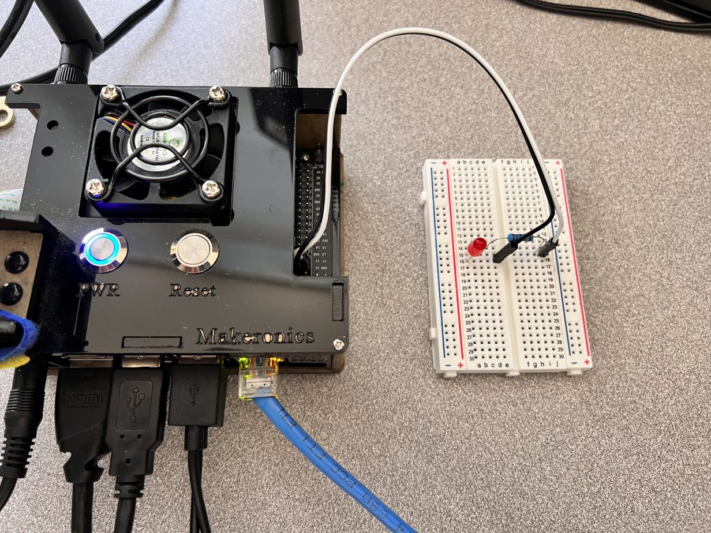

# Weed Detection with YOLOv5

## Environment Setup
1. Run `bash venv_setup.txt` . This will create a virtual environment called `venv` and clone the YOLOv5 repository.

2. Run `source venv/bin/activate` to activate the virtual environment.

3. Within the virtual environment run `pip install -r requirements.txt` to install the dependencies.

4. Run `deactivate` to close the virtual environment.

## Running the Inference
To run command line inference: `bash exec/cli_inf.txt`

To run PyTorch inference: `bash exec/pytorch_inf.txt`

Inference videos can be found within the `media` folder.

<b>**NOTE: </b> You may need to replace the arguments within the `--source` parameter (within the .txt file) with the registered device_id on your computer. 

## Setup for PyTorch Inference: Signal Output

"Pin Layout Info"

"Picture of Breadboard and Pin setup"

